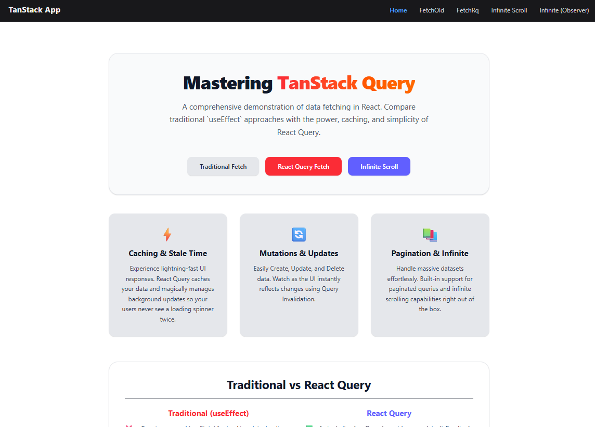
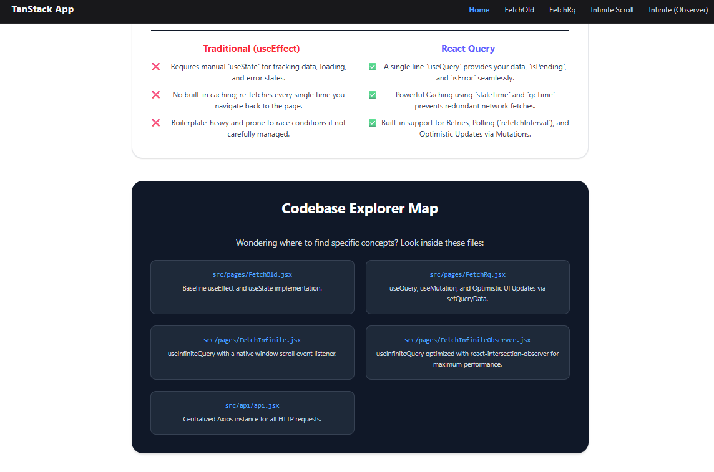
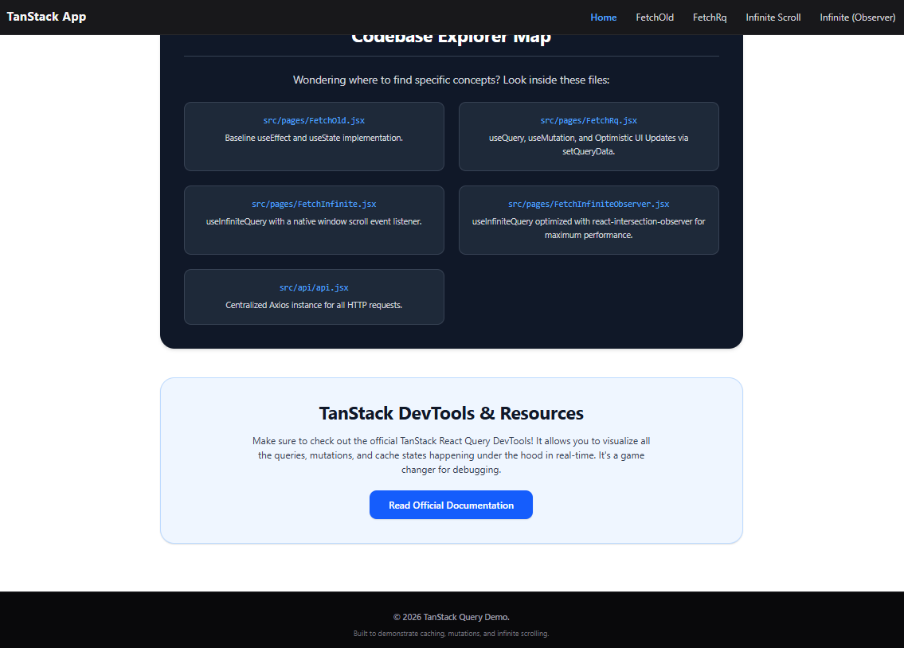
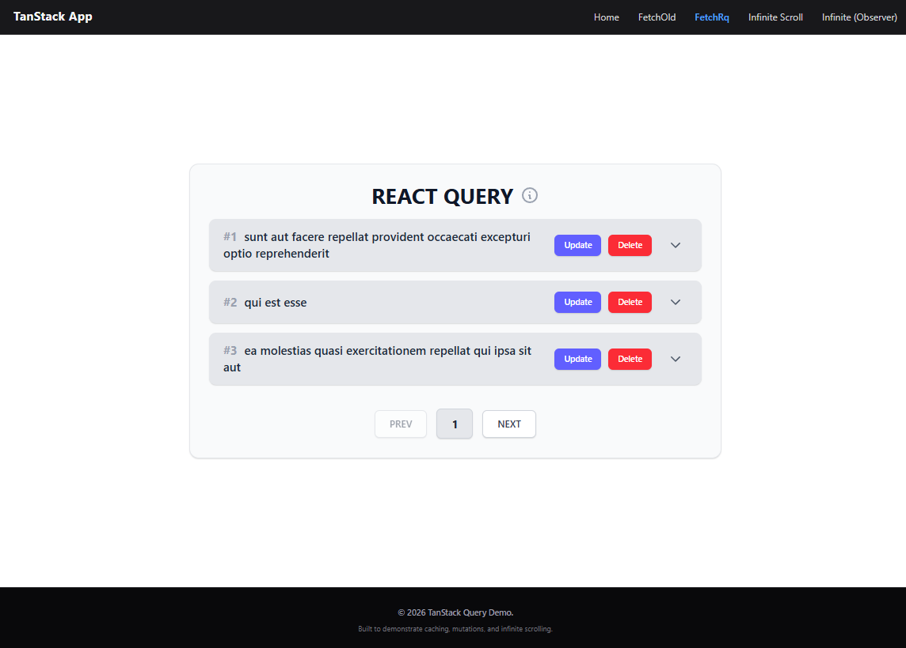
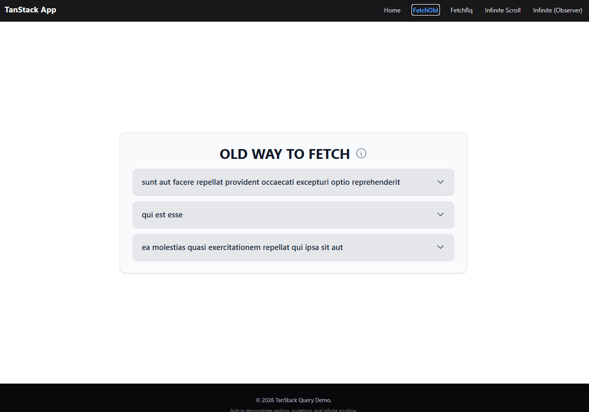
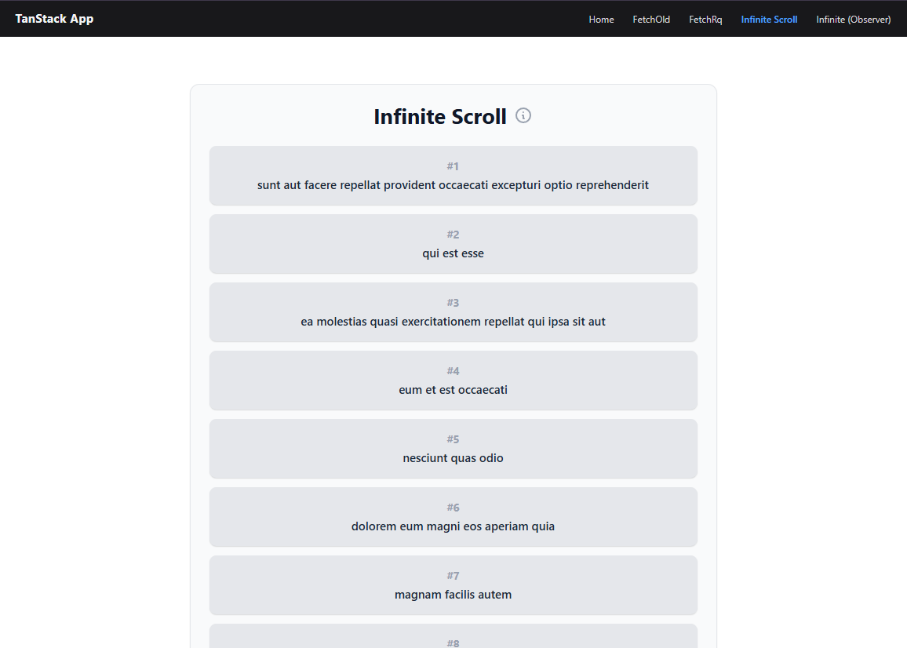
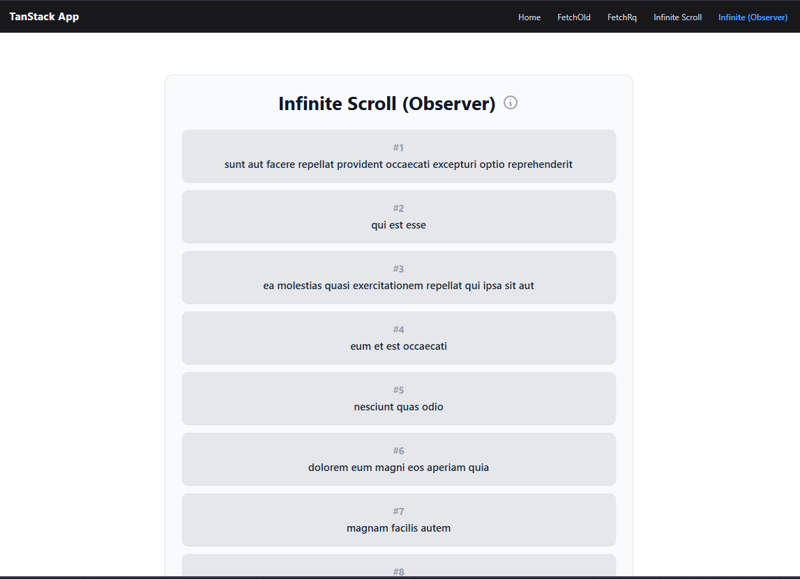

# TanStack Query (React Query) Practice Project 🚀

Hey there! 👋 I built this project to deeply understand how data fetching works in modern React applications. I wanted to move away from the traditional `useEffect` + `useState` approach and really get my hands dirty with **TanStack Query (v5)**. 

This repo serves as my personal playground and demonstration of why React Query is the industry standard for server-state management.

## What's inside?

I built a few different pages to compare approaches and test out features:

- **Traditional Fetching**: I started by building a basic data fetch using `useEffect` and `useState` just to remind myself of the boilerplate and edge cases (loading states, error handling, lack of caching).
- **React Query Basics**: I rewrote the same fetch using `useQuery`. It instantly simplified the code and gave me out-of-the-box caching!
- **Mutations (CRUD)**: I implemented `useMutation` to handle Deleting and Updating posts. I also used `queryClient.setQueryData` to instantly update the UI without needing to wait for a network refresh.
- **Pagination**: Added a paginated view that utilizes `keepPreviousData` so the UI doesn't awkwardly flash a loading spinner when clicking 'Next' or 'Prev'.
- **Infinite Scrolling**: My favorite part! I implemented `useInfiniteQuery` and hooked it up to a custom scroll listener. It seamlessly fetches the next page of data as soon as you hit the bottom of the screen.
- **Intersection Observer**: Re-implemented Infinite Scrolling using `react-intersection-observer` for maximum performance, proving there is always a better way to do things!

## 📸 App Gallery

Here are some snapshots of the application interfaces and the interactive tooltips I built to document my learnings right in the UI:

### Dashboard & Codebase Map
<div align="center">
  
  
  
</div>

### Fetch Comparisons & Interactive Notes
<div align="center">
  
  
</div>

### Infinite Scrolling Implementations
<div align="center">
  
  
</div>

## Tech Stack

- React 18
- TanStack Query (v5)
- Tailwind CSS (for quick, clean styling)
- Axios

## My Biggest Takeaways

Building this really solidified a few concepts for me:
- **`staleTime` vs `gcTime`**: Figuring out exactly how long data should stay fresh before refetching in the background, vs how long it should stay in memory after a component unmounts.
- **Query Invalidation**: How powerful it is to just tell React Query "Hey, the posts are outdated" and let it handle the refetching.
- **Infinite Queries**: Managing `pageParam` and `data.pages` was a bit tricky at first, but it completely abstracts away the headache of manually appending arrays.

## 📖 Glossary / Key Concepts from my Notes

Here are some exact notes I took while learning and implementing this project:

- **gcTime (Garbage Collection Time):** Previously known as `cacheTime` in v4. By default, inactive queries are garbage collected after 5 minutes. If a query is not being used for 5 minutes, its cache is cleaned up to save memory.
- **staleTime:** Determines how long fetched data is considered "fresh" before it needs to be refetched in the background. The default is `0`, meaning data becomes stale immediately after being fetched, ensuring you always get the most up-to-date info at the cost of frequent background fetching.
- **Polling (`refetchInterval`):** A technique to fetch data from an API at regular intervals to keep the UI completely synced with the server automatically.
- **useMutation:** The hook used for CRUD operations (Create, Update, Delete) that modify data on the server.
- **mutate():** The execution trigger for a mutation function. Unlike queries which fetch automatically, mutations must be explicitly executed!
- **Optimistic Updates:** A technique where we instantly update the UI to reflect a successful mutation *before* the server actually confirms it. We achieve this using `queryClient.setQueryData`.
- **Query Invalidation:** Telling React Query that a specific cache key (e.g., `["posts"]`) is no longer valid, forcing it to seamlessly refetch the data in the background (`queryClient.invalidateQueries`).
- **Intersection Observer:** A highly performant browser API used to detect when an element enters the screen. Perfect for triggering `fetchNextPage()` in infinite scrolling without overloading the browser with native window scroll events.
- **React Query DevTools:** An absolute game-changer. A built-in panel that lets you visualize every active query, cache state, and mutation happening in real-time.

## Running it locally

If you want to clone this and play around with the cache yourself:

```bash
npm install
npm run dev
```
